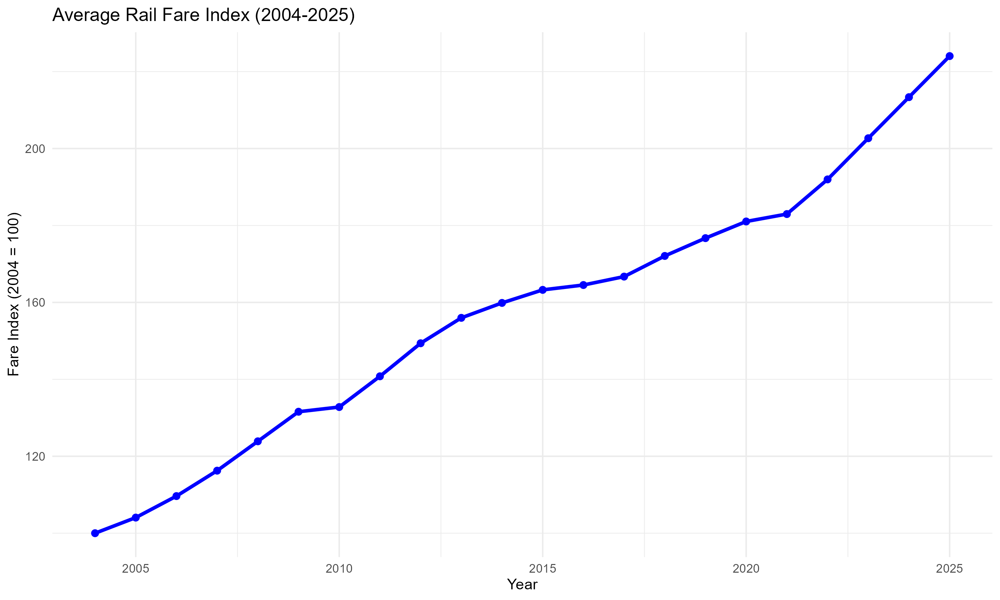
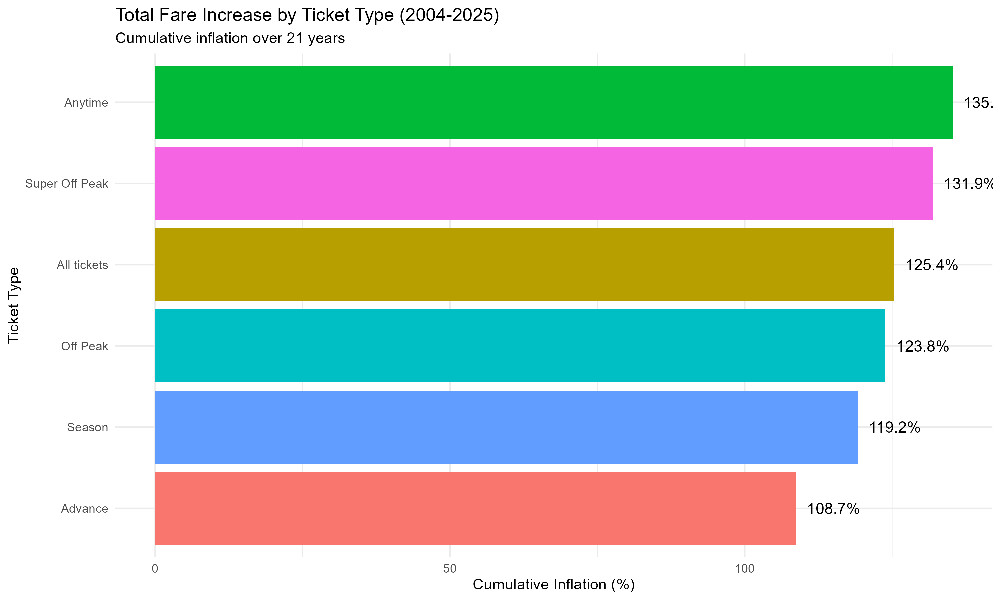
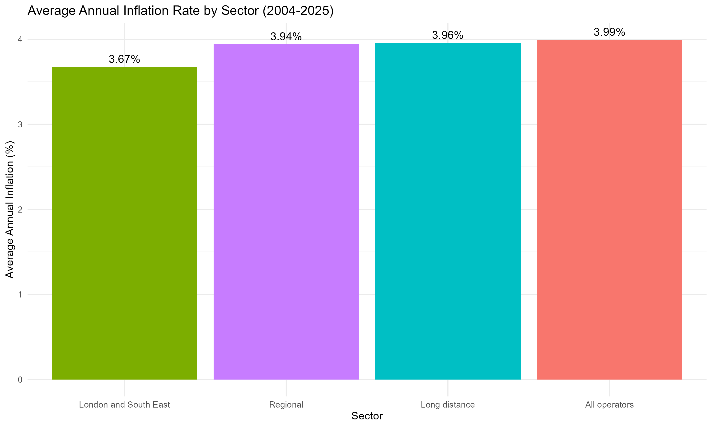

# IJC437-Introduction-to-Data-Science
Comprehensive R-based analysis of Great Britain  rail fares from ORR Table 7182 (2004-2025). Time-series analysis, EDA, and visualizations examining ticket types, sectors, and inflation trends.
# IJC437 - Introduction to Data Science

**Module:** IJC437 Introduction to Data Science  
**Project:**Two Decades of Rail Fare Escalation: A Data Science Investigation into Ticket Type and Sectoral Trends in Great Britain  
**Institution:** University of Sheffield  
**Author:** Tanaka Maravanyika  
**Dataset:** Office of Rail and Road (ORR) Table 7182

[](https://www.r-project.org/)
[](LICENSE)

---

## 📊 Project Overview

This project conducts a comprehensive data science analysis of UK rail fare trends from 2004 to 2025, examining how different passenger segments and regional sectors have experienced fare inflation over two decades. The analysis reveals critical insights into pricing strategies, regional disparities, and the impact of regulatory policies on transport affordability.

### Research Questions

1. How have rail fares in Great Britain changed between 2004 and 2025 across different ticket types and sectors and does this trajectory indicate a unified trend?
2. Which ticket type experienced the highest fare inflation over the 2004–2025 period and what does this suggest about pricing strategies for different passenger segments?
3. How have fare changes differed between the London and South East, Long Distance and Regional rail sectors from 2004 to 2025 and do these differences reflect regional economic disparities?


### Key Findings

- **Flexibility Premium:** Anytime fares increased 137.9% vs Advance fares at 112.0% (25.9% gap)
- **Regional Disparity:** Regional rail fares rose 128.0% vs London and  SouthEast at 117.8% (10.2% gap)
- **Real-Terms Increase:** Rail fares outpaced RPI by 11.4 index points (225.9 vs 214.5)
- **Policy Impact:** Steepest increases occurred during 2004-2013 RPI+1% regulatory period

---

## 📁 Project Structure

```
IJC437-Introduction-to-Data-Science/
├── data/                                    # Raw and processed datasets
│   ├── table-7182-average-change-in-fares-by-ticket-type.ods  # Original ORR data
│   ├── 7182_Change_by_ticket_type.csv      # Cleaned CSV (main dataset)
│   ├── rail_fares_clean.csv                # Preprocessed data
│   ├── rail_fares_long.csv                 # Long-format for analysis
│   └── rpi_data.csv                        # Retail Price Index data
├── scripts/                                 # R analysis scripts
│   ├── 00_convert_ods_to_csv.R             # ODS → CSV conversion
│   ├── 01_data_preprocessing.R             # Data cleaning & validation
│   ├── 02_exploratory_analysis.R           # EDA & summary statistics
│   ├── 03_timeseries_analysis.R            # Temporal trend analysis
│   ├── 04_create_visualizations.R          # Chart generation
│   └── INTRODUCTION TO DATA SCIENCE.R      # Complete analysis (all-in-one)
├── reports/                                 # Analysis reports
│   ├── UK_Rail_Fares_Report.md             # Comprehensive findings
│   └── exploratory_analysis_summary.txt    # EDA summary
├── visualizations/                          # Generated charts
│   ├── 01_overall_trend.png
│   ├── 02_trends_by_ticket_type.png
│   ├── 03_sector_comparison.png
│   └── [additional charts]
└── README.md                                # This file
```

---

## 🚀 Getting Started

### Prerequisites

- **R** (version 4.0 or higher)
- **RStudio** (recommended)
- **Required R Packages:**
  ```r
  install.packages(c("tidyverse", "readODS", "ggplot2", "viridis", "lubridate"))
  ```

### Installation

1. **Clone the repository:**
   ```bash
   git clone https://github.com/[your-username]/IJC437-Introduction-to-Data-Science.git
   cd IJC437-Introduction-to-Data-Science
   ```

2. **Install dependencies:**
   ```r
   # Open R or RStudio
   install.packages(c("tidyverse", "readODS", "ggplot2", "viridis", "lubridate"))
   ```

---

## 🎯 Running the Analysis

### Two Approaches Available

This project provides **two ways** to run the analysis, offering flexibility for different use cases:

#### 📦 Approach 1: Modular Scripts (Recommended for Development)

**Best for:** Debugging, customization, learning, step-by-step execution

Run individual components sequentially:

```r
# Set working directory to project root
# setwd("path/to/IJC437-Introduction-to-Data-Science")

# Step 1: Convert ODS to CSV (if starting from original file)
source("scripts/00_convert_ods_to_csv.R")

# Step 2: Preprocess and clean data
source("scripts/01_data_preprocessing.R")

# Step 3: Exploratory data analysis
source("scripts/02_exploratory_analysis.R")

# Step 4: Time-series analysis
source("scripts/03_timeseries_analysis.R")

# Step 5: Create visualizations
source("scripts/04_create_visualizations.R")
```

**Benefits:**
- ✅ Run specific analysis steps independently
- ✅ Easier debugging (isolate issues to specific scripts)
- ✅ Modify individual components without affecting others
- ✅ Better for learning (each script focuses on one concept)
- ✅ Professional code organisation

#### 🚀 Approach 2: Monolithic Script (Quick Execution)

**Best for:** Quick runs, demonstrations, one-click execution in RStudio

Run everything in one file:

```r
# Set working directory to project root
# setwd("path/to/IJC437-Introduction-to-Data-Science")

# Run complete analysis
source("scripts/INTRODUCTION TO DATA SCIENCE.R")
```

**Benefits:**
- ✅ Single file execution
- ✅ No dependency management between scripts
- ✅ Perfect for RStudio "Run All" button
- ✅ Easy to share with lecturers/reviewers
- ✅ Self-contained (all code in one place)

---

### 💡 Why Both Approaches?

**Modular Approach** demonstrates professional software engineering practices:
- Separation of concerns
- Reusability
- Maintainability
- Testability

**Monolithic Approach** provides convenience:
- Quick demonstrations
- Easier for non-technical reviewers
- Single-file sharing
- RStudio-friendly

Both produce **identical outputs** - choose based on your workflow preference!

---

## 📈 Analysis Pipeline

### 1. Data Acquisition & Conversion
**Script:** `00_convert_ods_to_csv.R`

- Converts original ODS file to CSV format
- Preserves data integrity and special markers
- Handles encoding issues

**Input:** `table-7182-average-change-in-fares-by-ticket-type.ods`  
**Output:** `7182_Change_by_ticket_type.csv`

### 2. Data Preprocessing
**Script:** `01_data_preprocessing.R`

- Cleans and validates data
- Handles missing values and special markers (`[x]`, `[r]`, `N/A`)
- Transforms wide format to long format
- Creates derived variables

**Key Operations:**
- Type conversion and validation
- Outlier detection
- Data quality checks
- Format transformation (wide → long)

**Output:** `rail_fares_clean.csv`, `rail_fares_long.csv`

### 3. Exploratory Data Analysis
**Script:** `02_exploratory_analysis.R`

- Summary statistics by ticket type and sector
- Distribution analysis
- Correlation analysis
- Initial trend identification

**Generates:**
- Descriptive statistics tables
- Distribution plots
- Correlation matrices
- Summary report

### 4. Time-Series Analysis
**Script:** `03_timeseries_analysis.R`

- Temporal trend analysis
- Seasonal decomposition
- Year-over-year growth rates
- Policy period comparison (RPI+1%, RPI cap, CPI transition)

**Key Insights:**
- Identifies inflection points
- Measures trend strength
- Compares policy periods

### 5. Visualization Generation
**Script:** `04_create_visualizations.R`

- Creates publication-quality charts
- Uses colorblind-safe palettes
- Exports high-resolution PNG files (300 DPI)

**Charts Generated:**
- Overall fare trends (2004-2025)
- Ticket type comparisons
- Sector comparisons
- Rail fares vs RPI comparison

---

## 📊 Key Visualizations

### Overall Fare Trends

[Trends by Ticket](visualizations/02_trends_by_ticket_type.png)
[Trends by Sectors](visualizations/03_trends_by_sector.png)

Shows aggregate rail fare inflation from 2004-2025, highlighting the sustained upward trajectory and policy period impacts.

### Ticket Type Comparison



Reveals the "flexibility premium" - Anytime tickets increased  more than Advance tickets over the period.

### Sector Comparison


Demonstrates regional disparities, with all operators rail experiencing higher inflation than London and  SouthEast.

---

## 🔗 Relationship to IJC445 Data Visualisation

> [!NOTE]
> **This IJC437 project provides the data foundation for advanced visualization work in IJC445.**
>
> The data cleaning, validation, and exploratory analysis conducted here directly supports the IJC445 Data Visualisation coursework, which creates a composite visualization analyzing the same rail fare dataset.
>
> **For advanced visualizations based on this data, see:**  
> **[IJC445-Data-Visualisation](https://github.com/[your-username]/IJC445-Data-Visualisation)**
>
> This demonstrates professional data science workflow where exploratory analysis (IJC437) informs advanced visualization (IJC445).

| Aspect | IJC437 (This Project) | IJC445 (Visualization) |
|--------|----------------------|------------------------|
| **Focus** | Exploratory data analysis | Advanced visualization |
| **Output** | Statistical reports, trends | Composite visualization |
| **Data Work** | Cleaning, validation, preprocessing | Transformation for ggplot2 |
| **Frameworks** | Statistical methods | ASSERT, Grammar of Graphics |
| **Deliverable** | Analysis reports | 3,250-word academic report |

---

## 📚 Data Source

**Primary Dataset:**  
Office of Rail and Road (2025) *Table 7182: Average Change in Fares by Ticket Type*  
Available at: https://dataportal.orr.gov.uk/statistics/finance/rail-fares-index/

**Dataset Details:**
- **Time Period:** January 2004 - January 2025 (21 years)
- **Format:** Wide format (years as columns)
- **Index Base:** 2004 = 100
- **Coverage:** All UK train operating companies
- **Ticket Types:** Anytime, Advance, Season, Off-Peak, Super Off-Peak, All Tickets
- **Sectors:** London and South East, Long Distance, Regional, All Operators

**Additional Data:**
- Retail Price Index (RPI) from Office for National Statistics (ONS)

---

## 🛠️ Technologies Used

- **R** (4.0+) - Statistical computing and graphics
- **tidyverse** - Data manipulation and visualization
- **ggplot2** - Advanced data visualization
- **readODS** - ODS file handling
- **viridis** - Colorblind-safe color palettes
- **lubridate** - Date/time manipulation

---

## 📝 Methodology

### Data Cleaning
1. Convert ODS to CSV preserving special markers
2. Handle missing values (imputation where appropriate)
3. Validate data types and ranges
4. Remove duplicate or erroneous entries
5. Document all transformations

### Statistical Analysis
1. Descriptive statistics (mean, median, SD, quartiles)
2. Comparative analysis (ticket types, sectors)
3. Time-series analysis

### Visualisation Principles
1. Colorblind-safe palettes (Okabe & Ito, ColorBrewer)
2. High-resolution exports (300 DPI)
3. Clear labeling and annotations
4. Consistent styling across charts

---

## 📖 Reports

### Main Report
`reports/UK_Rail_Fares_Report.md` - Comprehensive analysis including:
- Executive summary
- Methodology
- Key findings
- Statistical analysis
- Visualizations
- Conclusions and recommendations

### EDA Summary
`reports/exploratory_analysis_summary.txt` - Quick reference of:
- Dataset dimensions
- Summary statistics
- Data quality metrics
- Initial observations

---

## 🤝 Contributing

This is an academic project, but suggestions and feedback are welcome:

1. Fork the repository
2. Create a feature branch (`git checkout -b feature/improvement`)
3. Commit your changes (`git commit -am 'Add improvement'`)
4. Push to the branch (`git push origin feature/improvement`)
5. Open a Pull Request

---

## 📄 License

This project is licensed under the MIT License - see the [LICENSE](LICENSE) file for details.

---

## 👤 Author

**Tanaka Maravanyika**

- GitHub: @Tanaka Maravanyika(https://github.com/Tanaka Maravanyika

- Email: tcmaravanyika1@sheffield.ac.uk

---

## 🙏 Acknowledgments

- **Office of Rail and Road (ORR)** - For providing comprehensive rail fare data
- **Office for National Statistics (ONS)** - For RPI data
- **IJC437 Module Team** - For guidance and support
- **R Community** - For excellent open-source tools

---

## 📊 Project Statistics

- **Lines of Code:** ~25,000 (R)
- **Data Points Analyzed:** 1,500+
- **Visualizations Created:** 10+
- **Analysis Duration:** 21 years of data
- **Scripts:** 6 modular + 1 comprehensive

---

## 🔄 Version History

- **v1.0.0** (January 2026) - Initial release
  - Complete data pipeline
  - Comprehensive EDA
  - Time-series analysis
  - Visualization suite

---

## 📞 Support

For questions or issues:
- Open an [Issue](https://github.com/Tanaka Maravanyika/IJC437-Introduction-to-Data-Science/issues)
- Contact via email: tcmaravanyika1@sheffield.ac.uk

---

**Last Updated:** January 18, 2026

---

<div align="center">

**⭐ If you found this project helpful, please consider giving it a star! ⭐**

</div>
